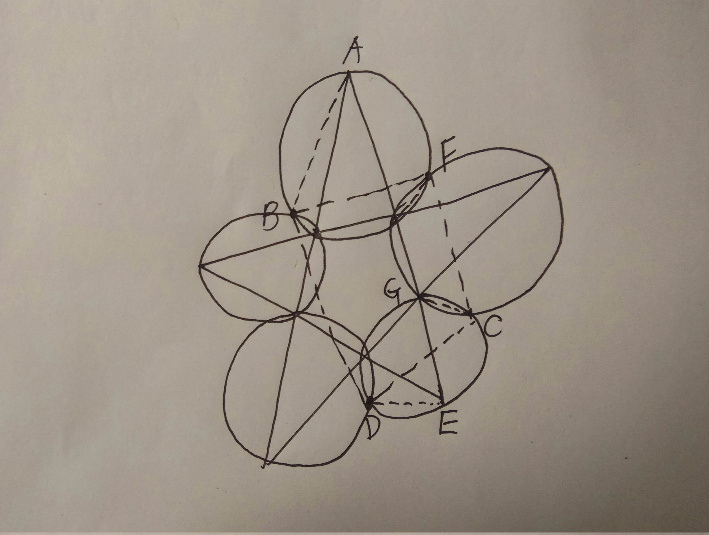

## 蛤之五点共圆

> *定理1* 给定一个五角星，在它的五个小角上作外接圆，相邻的外接圆相交，所得五个新的交点在一个大圆上。

这个命题曾被长者在视察澳门濠江中学时提出。据说难倒了很多人，就连数学大师丘成桐也想了半个小时才给出答案。足见长者几何学功底之深厚。这个问题的背景是*Clifford's circle theorem*，是本命题的一般化，也更为困难。

在解决这个问题之前，先引入一个引理：

> *引理1(**Miquel**)* 平面上的四条直线任意三条不共点且两两不平行，则每三条一组可以确定的四个圆共点，这个点叫**Wallace**点（又叫**Miquel**点）。

证明甚易，此处略去。利用引理1，可以给出定理1的一个简单证明。

*Proof*.  注意 A, B, D, E 四点共圆。

$\because \angle FCD=\angle FCG+\angle DCG=\angle ABF+\angle AED=\angle ABF+\pi-\angle ABD=\pi-DBF$.

$\therefore$ B, F, C, D 四点共圆。由对称性，五点共圆。 Qed.

作为补充，顺便提一下*Clifford's circle theorem*。容易看出，引理1和定理1对应定理2当n=2时的结论。

> *定理2(**Clifford's circle theorem**)*
>
> 平面上的2n条直线任意三条不共点且两两不平行，则每2n-1条一组可以确定2n个Clifford圆，这些圆共点，叫作Clifford点；平面内2n+1条直线任意三条不共点且两两不平行，则每2n条一组可以确定2n+1个Clifford点，这些点共圆，叫做Clifford圆。

2016/11/12